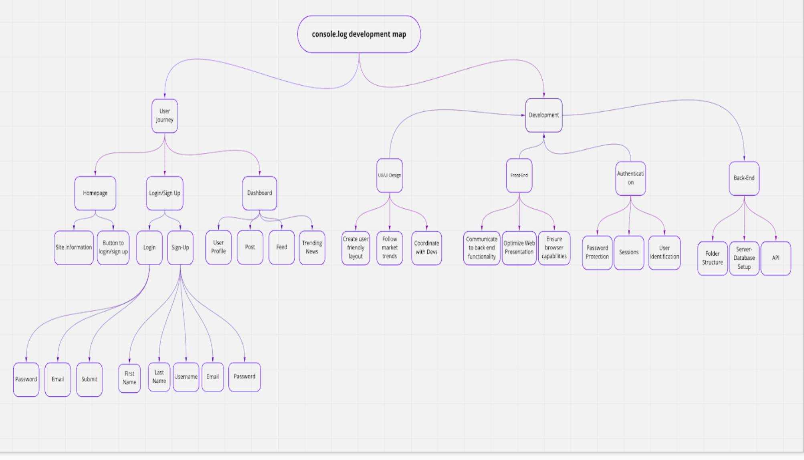
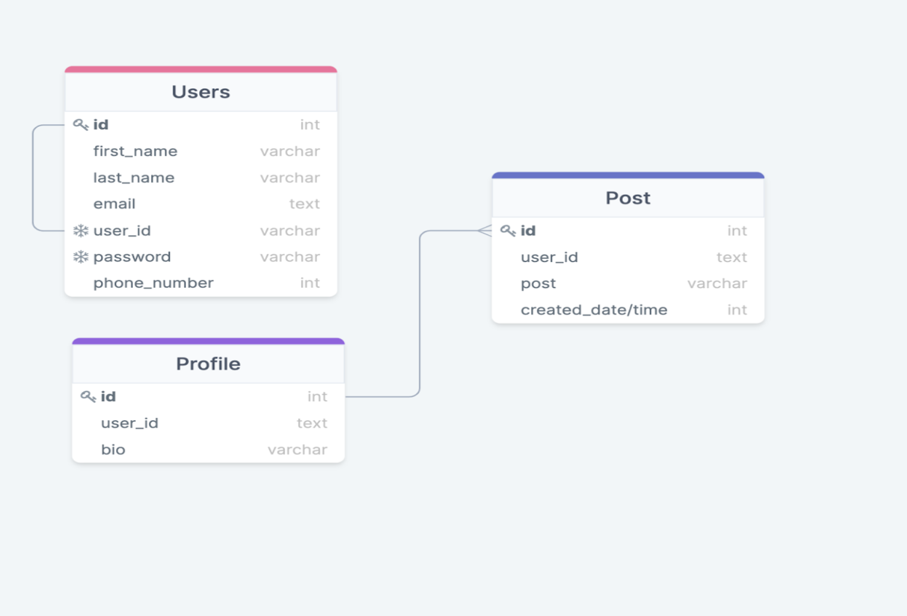

## Console.log Project: 
----------------------------
#### Description
- Console.log is a social media platform that allows users to share their passion about anything tech related.
- The main focus was to eliminate the need of searching for specific topics and looking through saturated feeds for things specific to what you want. 

----------------------------
#### Table of Contents
- [Description](#description)
- [Installation](#installation)
- [Process](#process)
- [License](#license)
- [Contributors](#contributors)
- [Contact](#contact)

----------------------------
#### Installation
- This application requires **Node.JS**
- To run application, first fill in neccessary information in **.env** file to connect to MySql
- Install necessary npm packages:
```md
    npm install || npm i
```
- Run schmea database in **db** folder:
```md
    mysql -u root -p
    source schema.sql
```
- Seed the database:
```md
    npm run seed
```
- Start application:
```md
    npm start || node server.js
```
----------------------------
#### Process



----------------------------
#### License


----------------------------
#### Contributors
* Paul Won
    * github: https://github.com/paulwon2223
    * email: wonpaul2223@gmail.com

* George Escobar
    * github: https://github.com/geoescobar
    * email: geo.escobar214@gmail.com

* Joshua Clancy
    * github: https://github.com/PBnJson
    * email: ukg_123@yahoo.com

* Maisha Alam
    * github: https://github.com/maishaalamm
    * email: maishaalam200214@gmail.com

----------------------------
#### Contact
- Project Github Repo: https://github.com/paulwon2223/Group-Project-2
- Heroku Link: 